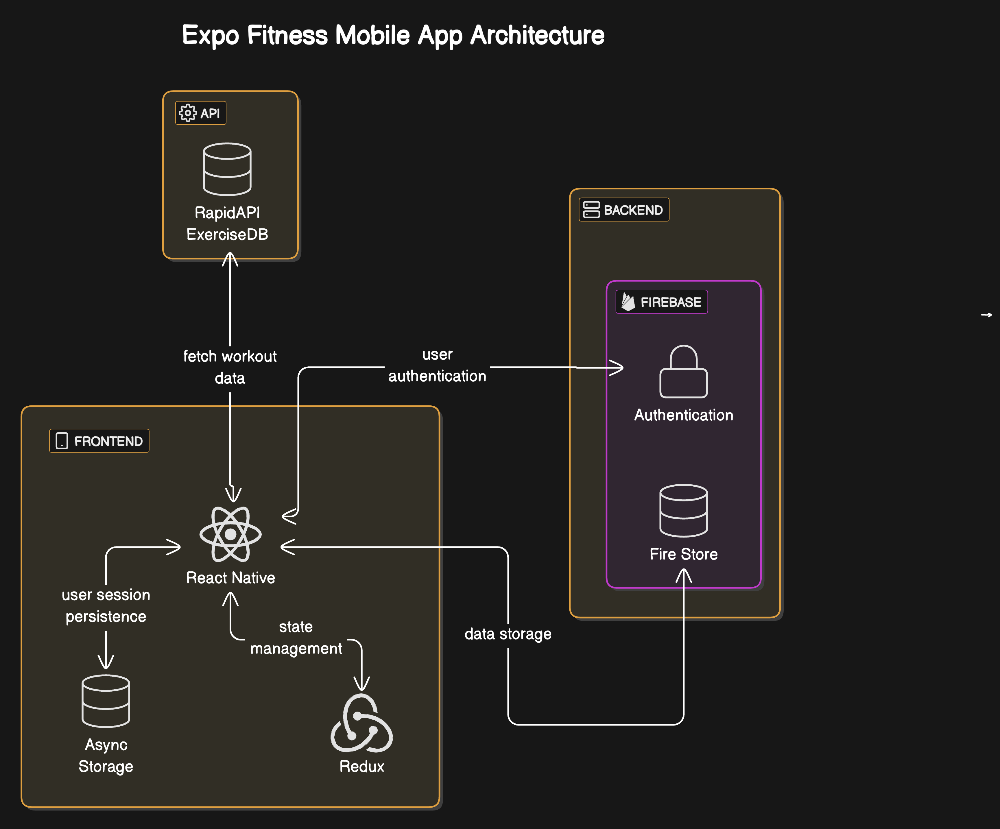

# Expo Fitness Mobile App

## Overview
The Expo Fitness Mobile App is a fitness application developed to help users to manage their workout plans efficiently. The app integrates an extensive exercise database, user authentication, state management, and data persistence.

## Features
- **User Authentication**: Secure user authentication using Firebase.
- **Workout Database**: Integration with RapidAPI ExerciseDB for fetching workout data.
- **State Management**: Efficient state management with Redux.
- **Session Persistence**: User session persistence with Async Storage.

## Architecture



### Architecture Components

1. **Frontend**:
   - **React Native with Expo**: For building the mobile user interface.
   - **Redux**: Handles state management for efficient application state updates.
   - **Async Storage**: Used for persisting user session data locally.

2. **API**:
   - **RapidAPI ExerciseDB**: Provides access to an extensive database of workout exercises.

3. **Backend**:
   - **Firebase**:
     - **Authentication**: Ensures secure user login and registration.
     - **Firestore**: For storing user-specific data such as workout logs and preferences.

### Data Flow
1. The user interacts with the frontend built using React Native.
2. API calls to RapidAPI ExerciseDB fetch workout data.
3. Firebase handles user authentication and stores user data in Firestore.
4. State management is handled by Redux to maintain the consistency of application state.
5. Async Storage is used to persist user sessions and local data.

## Installation and Setup

To set up and run the app locally, follow the steps below:

### Prerequisites
- Node.js and npm
- Expo CLI
- Firebase Project Configuration

### Steps
1. Clone the repository:
   ```bash
   git clone https://github.com/KasunJayasanka/expo-fitness.git
   cd expo-fitness
   ```

2. Install dependencies:
   ```bash
   npm install
   ```

3. Set up Firebase:
   - Create a Firebase project.
   - Add your Firebase configuration in a `firebaseConfig.js` file in the `src/api` folder.

4. Start the app:
   ```bash
   npm start
   ```

## Technologies Used
- **Frontend**: React Native, Expo
- **API**: RapidAPI ExerciseDB
- **Backend**: Firebase (Authentication, Firestore)
- **State Management**: Redux
- **Storage**: Async Storage

## Contributing
We welcome contributions! Please fork the repository, create a branch, and submit a pull request.
